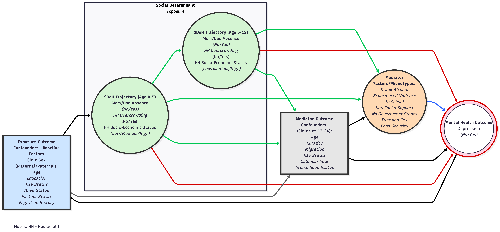

## 1. Introduction

This Statistical Analysis Plan (SAP) specifies the inferential framework for CO-LUMINATE, a longitudinal linked-data study designed to evaluate how social determinants of health influence depression among young people in rural South Africa. The document is written to align with the approved CO-LUMINATE proposal and to govern reproducible analysis of the linked cohort-household platform developed for this project.

The scientific motivation is to estimate both direct and indirect pathways between social stress exposures and depression, with explicit attention to life-course timing, mediation mechanisms, and uncertainty quantification. The analytic strategy is therefore structured around longitudinal exposure characterization, harmonized depression endpoint construction, and causal mediation modeling under prespecified assumptions.

## 2. Study Aim, Objectives, And Research Questions

The overarching aim is to quantify the longitudinal relationship between social determinants and depression symptoms among young people aged 13-24 years, and to evaluate mediation pathways through behavioral and psychosocial factors. In operational terms, this entails estimating how early and mid-childhood exposure patterns are associated with later depression risk, and whether those associations are explained in part by modifiable mediating factors measured during adolescence and young adulthood.

The proposal-level objectives are implemented in five linked analytical domains. First, the study describes population-level trajectories of socioeconomic position and caregiver co-residency. Second, it characterizes interactions between these social determinants and mediator domains relevant to youth mental health. Third, it defines and summarizes depression prevalence using a harmonized endpoint. Fourth, it estimates direct and mediated effects of social determinants on depression. Fifth, it integrates co-creation principles through interpretation and contextual framing of findings. Food insecurity was part of the original conceptual plan but is treated as unavailable for primary longitudinal trajectory modeling in the finalized linked analysis dataset (see amendment note in Section 12).

## 3. Data Sources And Analytical Cohort

The analytical platform integrates individual-level mental health data from youth cohorts nested within the AHRI HDSS with household-level longitudinal exposure histories from the surveillance system. The linked cohort includes participants from DREAMS, Multilevel, Isisekelo Sempilo, Treatment as Prevention (TasP), and Thetha Nami, with harmonized follow-up structures sufficient for trajectory and mediation analyses.

The primary analysis population includes participants who satisfy both endpoint and linkage requirements: availability of a valid depression endpoint (`DPBN`) and valid linkage to longitudinal household social-determinant data. Final inferential models are estimated only on participants meeting these criteria. Cohort assembly, exclusions, and denominator transitions are reported transparently in metadata and CONSORT-style flow summaries.

## 4. Conceptual Causal Model

The core causal structure is represented by a directed acyclic graph in which childhood social stress exposures affect depression through both direct pathways and indirect pathways operating via behavioral or social mediators. The framework assumes temporally ordered pathways from childhood exposure windows (0-5 years; 6-12 years), through adolescent mediator profiles, to depression outcome status in adolescence and young adulthood.

::: {.aim-dag}
<figure>
  <figcaption>DAG: Conceptual mediation framework for CO-LUMINATE</figcaption>
  
</figure>
:::

## 5. Endpoints, Exposures, Mediators, And Covariates

### 5.1 Primary Endpoint

The primary endpoint is binary depression status (`DPBN`). This endpoint is defined on a harmonized psychometric scale that combines directly observed PHQ-based information with SSQ-based calibrated scoring where PHQ is unavailable. Harmonization procedures are fixed prior to mediation model fitting to avoid post-hoc endpoint drift.

### 5.2 Social Determinant Exposures

Exposure domains are modeled longitudinally and include caregiver co-residency and household socioeconomic conditions. Exposure histories are summarized through latent trajectory/class structures within prespecified childhood windows (0-5 years and 6-12 years), and these classes are encoded as analytical indicators for downstream structural models. The planned household food insecurity trajectory domain is not included in primary analyses because the required longitudinal measure was not obtained in the final analytical data assembly.

### 5.3 Mediators

The prespecified observed mediator set for primary modeling comprises alcohol use (`DNKA`), sexual behavior (`ESXC`), government grant access (`GOVG`), violence exposure (`VLNC`), social support (`SCSP`), and school attendance (`SCHL`). In addition to this observed parallel mediator representation, a latent mediator phenotype class is estimated as an alternative mediation structure to assess whether mediator clustering yields a more coherent mechanistic profile.

### 5.4 Confounder Strategy

Two confounder blocks are prespecified. Baseline confounders capture pre-exposure structural context, including maternal and paternal demographic, educational, HIV, partnership, and migration attributes. Mediator-outcome confounders include sex, age, HIV status, orphanhood, external migration, rural residence, and calendar year. Adjustment sets are fixed before primary effect estimation and are applied consistently across model families, with sensitivity analyses evaluating the impact of alternative adjustment scope.

## 6. Statistical Principles

All primary inferential analyses adopt a Bayesian estimation framework implemented in Mplus. Effect estimation is based on posterior summaries and 95% credible intervals, with primary interpretation focused on interval compatibility with null and effect magnitude. Statistical significance language is used cautiously and is secondary to estimation and uncertainty reporting.

Primary estimands are: (i) direct effects of childhood exposure class indicators on depression; (ii) specific natural indirect effects through each observed mediator; and (iii) natural indirect effects through the latent mediator phenotype class. These estimands are interpreted under standard causal mediation assumptions, including exchangeability conditional on measured covariates, positivity, and correct model specification.

## 7. Analytical Workflow

### 7.1 Descriptive And Data Quality Analyses

Descriptive analyses quantify cohort composition, missingness structure, prevalence of endpoint and mediator domains, and distribution of exposure classes. These analyses serve both quality control and interpretive context and are reported before causal models.

### 7.2 Longitudinal Exposure Modeling

Exposure trajectories are modeled separately in childhood windows (0-5 years; 6-12 years). Candidate class structures are evaluated using fit indices, class interpretability, and practical constraints including minimum class prevalence. Selected class solutions are locked prior to mediation estimation.

### 7.3 Depression Harmonization

Depression harmonization uses calibrated psychometric modeling to map SSQ-only records onto a PHQ-referenced depression scale, after which a fixed binary endpoint (`DPBN`) is derived. This harmonization stage is treated as upstream data preparation and not iteratively tuned based on mediation outcomes.

### 7.4 Primary Causal Mediation Models

Two model families are estimated to address complementary mechanistic assumptions. The first uses observed parallel mediators, where each mediator is regressed on exposure indicators and confounders, and the depression endpoint is regressed on all mediators, exposures, and confounders. Natural indirect effects are estimated via parametric g-computation syntax in Mplus (`MODEL INDIRECT ... (CAUSAL)`), pooled over multiple imputation/plausible-value draws.

The second model family uses a latent categorical mediator phenotype, where exposure indicators predict latent class membership and the endpoint is modeled as a function of latent mediator class, exposure indicators, and confounders. This approach evaluates whether mediator co-occurrence patterns provide stronger explanatory structure than separate observed mediators.

For pooled Bayesian analyses, the target imputation/plausible-value framework is `m = 100` draws. Posterior estimates are extracted and summarized in publication-ready effect tables with explicit interval reporting.

## 8. Missing Data And Imputation

Missing data are handled through a structured imputation-aware modeling workflow integrated with Bayesian estimation. Covariate and mediator missingness are addressed under model-based assumptions consistent with the imputation design. Participants with structurally missing core linkage components or unavailable primary endpoint are excluded according to prespecified rules. Sensitivity comparisons include reduced models and complete-case contrasts to assess robustness of substantive conclusions.

## 9. Sensitivity, Robustness, And Secondary Analyses

Robustness is assessed along four dimensions: mediator representation (observed vs latent), class solution alternatives, covariate adjustment sets, and depression endpoint threshold specification. Additional sensitivity summaries include effect-stability diagnostics and E-value style reporting for key indirect pathways where applicable. These analyses are interpreted as robustness evidence and do not replace the prespecified primary estimands.

Subgroup summaries by sex, age band, rural context, and HIV status are reported descriptively or as exploratory heterogeneity assessments unless explicitly prespecified for confirmatory inference.

## 10. Reporting Standards

All primary and sensitivity outputs are reported with clear separation between estimand definition, model specification, and interpretation. Tables and figures present posterior estimates, interval bounds, and pathway labels mapped to the conceptual framework. Interpretation emphasizes direction, magnitude, and uncertainty, and avoids causal overstatement beyond assumptions supported by design and measured covariates.

## 11. Reproducibility, Governance, And Data Use Constraints

The SAP is operationalized through version-controlled scripts organized into data preparation, model fitting, extraction, and reporting modules. Analytical objects (`.rds`), tables, and figures are generated from scripted pipelines and traced to model configuration files.

Participant-level private data remain in controlled environments. Public-facing website outputs are restricted to non-disclosive summaries, derived figures, and metadata artifacts. Access to full internal proposal and restricted analysis products remains governed by the Principal Investigator and project governance procedures.

## 12. SAP Versioning And Amendments

This SAP reflects the current CO-LUMINATE scientific plan and linked-data workflow. Any amendments to endpoint definition, exposure class selection, covariate sets, mediator structure, or inferential model family will be logged as SAP updates with explicit rationale, implementation date, and impact statement on prior results.

### 12.1 Amendment Record

On March 5, 2026, the SAP was amended to document that food insecurity was not obtained in the finalized longitudinal exposure build for this phase of CO-LUMINATE. As a result, food insecurity is removed from the primary longitudinal exposure specification and from the primary observed mediator set used for confirmatory mediation models in this SAP version.
